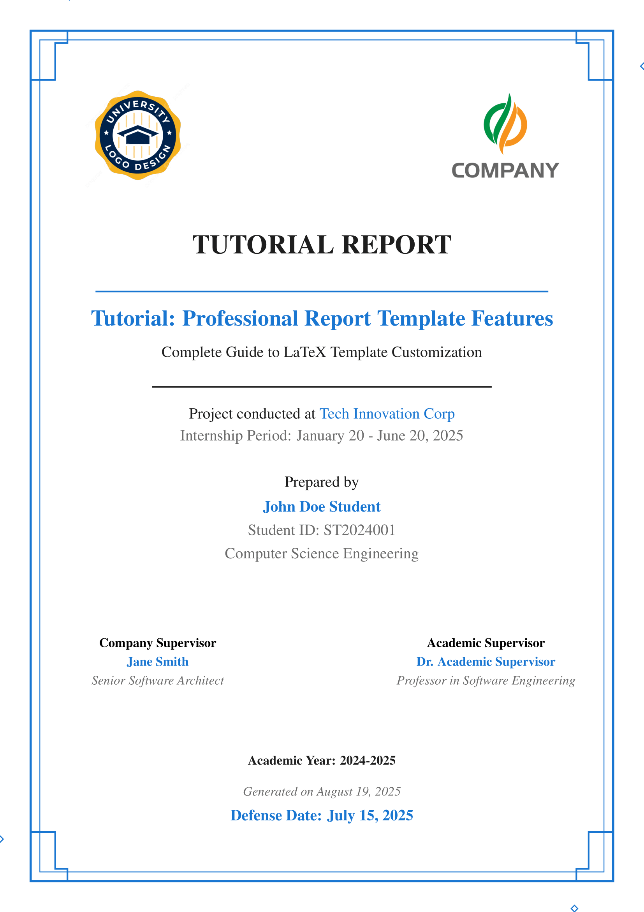
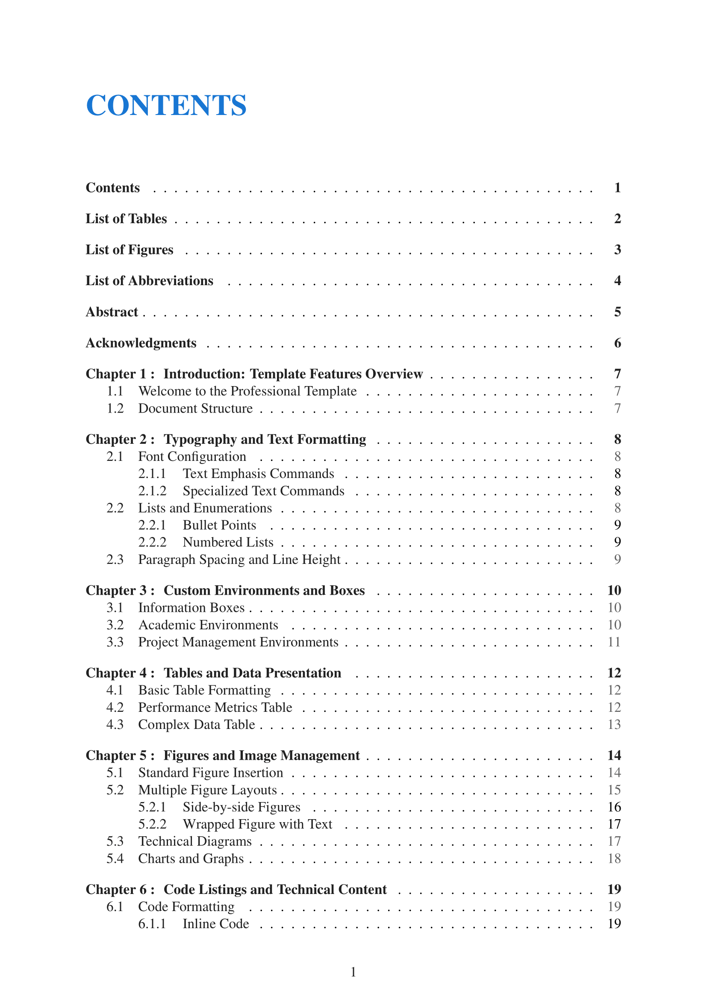
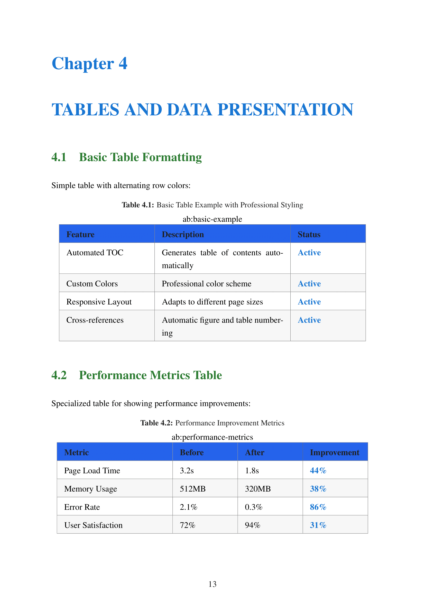

<div align="center">

# Professional LaTeX Report Template

     

**Professional, modular LaTeX template** for internship reports, thesis, and academic documents.  
Modern typography • Automated compilation • Cross-platform compatibility

[📖 Complete Tutorial](TUTORIAL.md) • [🚀 Quick Start](#-quick-start) • [🔧 Commands](#-commands) • [🤝 Contributing](#-contributing)

</div>

---

## ✨ Key Features

- **Professional Typography** - Times New Roman, optimized spacing, clean layouts
- **Automated Compilation** - Python scripts with auto-watch mode
- **Modular Architecture** - Separated configuration, content, and templates
- **Cross-Platform** - Windows, macOS, Linux, and Overleaf compatible
- **Smart References** - Automatic numbering and hyperlinked cross-references
- **Academic Standards** - Follows international formatting guidelines

## 📸 Preview

See Sample tutorial document based on this template [here](build/main.pdf).

<details open>
<summary><strong>Template Screenshots</strong></summary>

<table>
<tr>
    <th></th>
    <th></th>
</tr>
<tr>
    <td>
    <strong>Title Page</strong>
    </td>
    <td>
    <strong>Chapter Layout</strong>
    </td>
</tr>
<tr>
    <td>
    
    </td>
    <td>
    
    </td>
</tr>
<tr>
    <td>
        <strong>Tables and Figures</strong>
    </td>
    <td>
        <strong>Bibliography</strong>
    </td>
</tr>
<tr>
    <td>
        
    </td>
    <td>
        
    </td>
</tr>
</table>

</details>

## 🛠️ Tech Stack

This template leverages modern LaTeX packages and tools for optimal document production:

<details>
<summary><strong>↕️ Expand for more!</strong></summary>
<br/>

<div align="center">


| **Category** | **Technology** | **Role** |
|--------------|----------------|----------|
| **Document Engine** |  | Document typesetting |
| |  | Compilation engine |
| |  | Bibliography processor |
| **Typography** |  | Font system |
| |  | Icon system |
| |  | Page layout |
| **Core Packages** |  | Bibliography management |
| |  | PDF features |
| |  | Advanced boxes |
| |  | Graphics engine |
| **Development Tools** |  | Build automation |
| |  | Development environment |
| |  | Version control |
| **Online Platforms** |  | Cloud editing |
| |  | Repository hosting |
| **Diagram Tools** |  | UML diagrams |
| |  | Flowcharts |
| |  | Technical drawings |

</div>

</details>

## 📋 Prerequisites

**For Local Use:**
- LaTeX Distribution (TeX Live 2023+ or MiKTeX)
- Python 3.8+
- Git

## 🚀 Quick Start

### Option 1: Use Online (Easiest)

1. **Download** this repository as ZIP
2. **Upload to [Overleaf](https://overleaf.com)**
3. **Set compiler** to `pdfLaTeX`
4. **Edit `metadata.tex`** with your information
5. **Start writing** in `content/chapters/`

### Option 2: Local Development

```bash
# Clone and setup
git clone https://github.com/sikatikenmogne/latex-report-template.git
cd latex-report-template

# Check environment
python scripts/check.py

# Compile document
python scripts/compile.py

# Watch for changes (auto-compile)
python scripts/watch.py
```

**For Online Use:**
- [Overleaf](https://overleaf.com) account (free)

## 🔧 Commands

| Command | Description |
|---------|-------------|
| `make build` | Compile the document |
| `make watch` | Auto-compile on file changes |
| `make release TAG=v1.0.0` | Create new release |
| `python scripts/check.py` | Validate environment |
| `python scripts/release.py list` | List all releases |

## 📁 Project Structure

```
latex-report-template/
├── main.tex                    # Main document
├── metadata.tex                # Your information here
├── titlepage.tex               # Custom title page
├── internshipreport.cls        # Document class
├── config/                     # Template configuration
│   ├── colors.tex              # Color scheme
│   ├── packages.tex            # LaTeX packages
│   └── style.tex               # Typography
├── content/                    # Your content
│   ├── chapters/               # Main chapters
│   └── frontmatter/            # TOC, abstract, etc.
├── scripts/                    # Build automation
│   ├── compile.py              # Compilation script
│   ├── watch.py                # Auto-compiler
│   └── release.py              # Release management
└── assets/                     # Images and logos
    ├── images/                 # Your figures
    └── logos/                  # Institution logos
```

## 📖 Documentation

**📘 Complete Guide:** [TUTORIAL.md](TUTORIAL.md) - Comprehensive documentation with examples

**⚡ Quick References:**
- [Installation Guide](TUTORIAL.md#-quick-start)
- [Configuration](TUTORIAL.md##️-basic-configuration)
- [Writing Content](TUTORIAL.md##️-writing-content)

## 🎯 Quick Configuration

Edit `metadata.tex` with your information:

```latex
\renewcommand{\reporttitle}{Your Report Title}
\renewcommand{\reportauthor}{Your Name}
\renewcommand{\company}{Company Name}
\renewcommand{\university}{Your University}
\renewcommand{\defensedate}{Date}
```

That's it! The template handles the rest automatically.

## 🚀 Release Management

Create automatic releases with PDF generation:

```bash
# Create release (any tag format)
python scripts/release.py create v1.0.0
python scripts/release.py create final
python scripts/release.py create 2024-12-19

# Or with make
make release TAG=v1.0.0
```

GitHub Actions automatically compiles LaTeX and creates releases with PDF attachments.

## 🎨 Customization

### Colors
Edit `config/colors.tex`:
```latex
\definecolor{primarycolor}{RGB}{25,118,210}
\definecolor{secondarycolor}{RGB}{0,82,147}
```

### Environments
Use custom environments:
```latex
\begin{infobox}[Title]
Important information here
\end{infobox}

\begin{successbox}
Achievement or positive result
\end{successbox}
```

### Commands
Special text formatting:
```latex
\important{highlighted text}
\technology{React.js}
\company{Microsoft}
```

## 🤝 Contributing

Contributions welcome! Please follow our guidelines for the best experience.

### Quick Contribution
1. Fork the repository
2. Create feature branch: `git checkout -b feature/amazing-feature`
3. Commit changes: `git commit -m 'Add amazing feature'`
4. Push and create Pull Request

### Reporting Issues
- 🐛 [Bug Reports](https://github.com/sikatikenmogne/latex-report-template/issues/new?template=bug_report.yml)
- ✨ [Feature Requests](https://github.com/sikatikenmogne/latex-report-template/issues/new?template=feature_request.yml)

## 📄 License

This project is licensed under the **MIT License** - see [LICENSE](LICENSE) for details.

**TL;DR:** Free to use, modify, and distribute for any purpose.

## 🆘 Support

**Need Help?**
- 📖 [Read the Tutorial](TUTORIAL.md)
- 💬 [GitHub Discussions](https://github.com/sikatikenmogne/latex-report-template/discussions)
- 🐛 [Report Issues](https://github.com/sikatikenmogne/latex-report-template/issues)
- 📧 [Email Support](mailto:sikatikenmogne@gmail.com)

**Common Solutions:**
- Compilation errors → `python scripts/check.py`
- Missing packages → Install full LaTeX distribution
- VS Code setup → Install LaTeX Workshop extension

---

<div align="center">

**⭐ Found this useful? Give it a star!**

[Star this repo](https://github.com/sikatikenmogne/latex-report-template) • [Fork it](https://github.com/sikatikenmogne/latex-report-template/fork) • [Download ZIP](https://github.com/sikatikenmogne/latex-report-template/archive/refs/heads/main.zip)

**Built with ❤️ for the latex lovers**

</div>