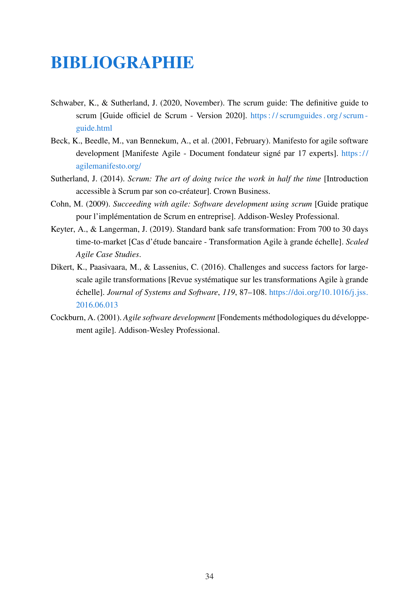

<div align="center">

# 📄 Professional LaTeX Report Template

     

A **professional, modular LaTeX template** for internship reports, thesis, and academic documents. Built with **modern typography**, **automated compilation**, and **cross-platform compatibility**.

[📚 Tutorial](TUTORIAL.md) • [🚀 Quick Start](#-quick-start) • [📖 Documentation](#-documentation) • [💡 Examples](#-examples) • [🤝 Contributing](#-contributing)

</div>

## ✨ Features

- 🎨 **Professional Typography** - Times New Roman, optimized spacing, and clean layouts
- 🔧 **Modular Architecture** - Separated configuration, content, and templates
- ⚡ **Automated Compilation** - Python scripts for easy building and debugging
- 🌍 **Cross-Platform** - Works on Windows, macOS, and Linux
- 📱 **Responsive Design** - Optimized for both print and digital viewing
- 🎯 **Academic Standards** - Follows international academic formatting guidelines
- 🔄 **Version Control Ready** - Git-friendly structure with proper .gitignore
- 🎪 **Rich Environments** - Custom boxes, tables, code listings, and diagrams
- 📊 **Advanced Graphics** - TikZ, PlantUML, Mermaid diagram support
- 🔗 **Smart Cross-References** - Automatic numbering and hyperlinked references

## 🛠️ Tech Stack

This template leverages modern LaTeX packages and tools for optimal document production:

| **Category** | **Technology** | **Version** | **Role** | **Why This Choice** |
|--------------|----------------|-------------|----------|-------------------|
| **📝 Document Engine** | **LaTeX** | 2023+ | Document typesetting | Industry standard, precise control |
| | **XeLaTeX/pdfLaTeX** | Latest | Compilation engine | Unicode support, modern fonts |
| | **Biber** | 2.19+ | Bibliography processor | Modern BibTeX replacement |
| **🎨 Typography** | **Times/mathptmx** | - | Font system | Professional appearance |
| | **FontAwesome** | 6+ | Icon system | Scalable vector icons |
| | **Geometry** | Latest | Page layout | Precise margin control |
| **📦 Core Packages** | **biblatex** | Latest | Bibliography management | Modern citation system |
| | **hyperref** | Latest | PDF features | Clickable links, bookmarks |
| | **tcolorbox** | Latest | Advanced boxes | Professional callouts |
| | **tikz/pgfplots** | Latest | Graphics engine | High-quality diagrams |
| **🔧 Development Tools** | **Python** | 3.8+ | Build automation | Cross-platform scripting |
| | **VS Code** | Latest | Development environment | LaTeX Workshop integration |
| | **Git** | 2.0+ | Version control | Collaboration, history |
| **🌐 Online Platforms** | **Overleaf** | - | Cloud editing | Collaborative editing |
| | **GitHub** | - | Repository hosting | Version control, sharing |
| **📊 Diagram Tools** | **PlantUML** | Latest | UML diagrams | Software architecture |
| | **Mermaid** | Latest | Flowcharts | Process diagrams |
| | **TikZ** | Latest | Technical drawings | Precise graphics |

## 📋 Prerequisites

### Local Installation

- **LaTeX Distribution**: TeX Live 2023+ (recommended) or MiKTeX 2023+
- **Python**: 3.8+ (for build scripts)
- **Biber**: 2.19+ (for bibliography processing)
- **Git**: 2.0+ (for version control)

### Online Alternative

- **Overleaf Account** (free tier available)
- Modern web browser

## 🚀 Quick Start

### Option 1: Local Development

```bash
# Clone the repository
git clone https://github.com/sikatikenmogne/latex-report-template.git
cd latex-report-template

# Initialize project structure
python init_project_structure.py

# Install required LaTeX packages (if needed)
python scripts/install_packages.py

# Quick compilation
python scripts/compile.py

# Watch mode for development
python scripts/watch.py
```

### Option 2: Overleaf (Recommended for Beginners)

1. 📁 **Upload to Overleaf**
   - Download the template as ZIP
   - Create new project on [Overleaf](https://overleaf.com)
   - Upload and extract the ZIP file

2. ⚙️ **Configure Overleaf Settings**
   - Set compiler to `pdfLaTeX` or `XeLaTeX`
   - Enable `Biber` for bibliography
   - Set main document to `main.tex`

3. ✏️ **Start Writing**
   - Edit `config/metadata.tex` with your information
   - Add content in `content/chapters/`
   - Compile and preview

### Option 3: GitHub Codespaces

[](https://codespaces.new/sikatikenmogne/latex-report-template)

## 📖 Documentation

### Quick Configuration

1. **Set Document Metadata** (`config/metadata.tex`):
```latex
\reporttitle{Your Report Title}
\reportauthor{Your Name}
\company{Company Name}
\university{Your University}
% ... other metadata
```

2. **Customize Colors** (`config/colors.tex`):
```latex
\definecolor{primarycolor}{RGB}{25,118,210}
\definecolor{accentcolor}{RGB}{0,82,147}
```

3. **Add Content** (`content/chapters/chapter1.tex`):
```latex
\chapter{Introduction}
Your content here...
```

### Build Commands

| Command | Description | Usage |
|---------|-------------|-------|
| `python scripts/compile.py` | Full compilation | Production builds |
| `python scripts/compile.py --quick` | Fast single-pass | Draft writing |
| `python scripts/compile.py --clean` | Clean build | Troubleshooting |
| `python scripts/watch.py` | Auto-compilation | Active development |
| `python scripts/check.py` | Validate setup | Environment check |

### Advanced Features

- **Custom Environments**: `\begin{infobox}`, `\begin{warningbox}`, `\begin{successbox}`
- **Special Commands**: `\important{text}`, `\technology{name}`, `\companyref{name}`
- **Figure Templates**: Professional layouts in `templates/figures.tex`
- **Table Styles**: Consistent formatting in `templates/tables.tex`

## 🗂️ Project Structure

```
latex-report-template/
├── 📁 .vscode/                    # VS Code configuration
│   ├── extensions.json            # Recommended extensions
│   ├── settings.json              # Editor settings
│   └── tasks.json                 # Build tasks
├── 📁 assets/                     # Static assets
│   ├── 📁 fonts/                  # Custom fonts
│   ├── 📁 images/                 # Image organization
│   │   ├── 📁 architecture/       # System diagrams
│   │   ├── 📁 charts/             # Data visualizations
│   │   ├── 📁 diagrams/           # Technical diagrams
│   │   ├── 📁 figures/            # General figures
│   │   └── 📁 screenshots/        # Application screenshots
│   └── 📁 logos/                  # Company/institution logos
├── 📁 build/                      # Compilation output
│   ├── 📁 config/                 # Build configuration
│   ├── 📁 templates/              # Build templates
│   └── main.pdf                   # Generated PDF
├── 📁 config/                     # Template configuration
│   ├── colors.tex                 # Color scheme
│   ├── commands.tex               # Custom commands
│   ├── metadata.tex               # Document metadata
│   ├── packages.tex               # LaTeX packages
│   └── style.tex                  # Typography settings
├── 📁 content/                    # Document content
│   ├── 📁 backmatter/             # Bibliography, appendices
│   │   └── bibliography.bib       # Reference database
│   ├── 📁 chapters/               # Main content chapters
│   └── 📁 frontmatter/            # Title page, TOC, abstract
├── 📁 diagrams/                   # Diagram source files
│   ├── 📁 mermaid/                # Mermaid diagrams
│   ├── 📁 plantuml/               # PlantUML diagrams
│   └── 📁 tikz/                   # TikZ graphics
├── 📁 scripts/                    # Build automation
│   ├── check.py                   # Environment validation
│   ├── clean.py                   # Clean build files
│   ├── compile.py                 # Main compilation script
│   ├── install_packages.py        # Package installer
│   ├── setup_template.py          # Project setup
│   └── watch.py                   # Auto-compilation
├── 📁 templates/                  # Reusable components
│   ├── boxes.tex                  # Custom environments
│   ├── figures.tex                # Figure templates
│   └── tables.tex                 # Table templates
├── .gitignore                     # Git ignore rules
├── init_project_structure.py      # Project initializer
├── internshipreport.cls           # LaTeX document class
├── main.tex                       # Main document file
├── package.json                   # Node.js dependencies (optional)
├── README.md                      # This file
└── TUTORIAL.md                    # Comprehensive tutorial
```

## 💡 Examples

<details>
<summary><strong>📸 Template Preview</strong></summary>

Theses ScreenShot cames from the [template sample PDF](/build/main.pdf)

### Title Page


### Chapter Layout


### Tables and Figures


### Bibliography


</details>

## 📚 Resources

### 🎓 Learning LaTeX

- [📖 LaTeX Tutorial](TUTORIAL.md) - Comprehensive guide included with template
- [🌐 Overleaf Learn](https://www.overleaf.com/learn) - Online LaTeX documentation
- [📚 LaTeX Wikibook](https://en.wikibooks.org/wiki/LaTeX) - Community-driven guide
- [🎥 LaTeX Video Tutorials](https://www.youtube.com/results?search_query=latex+tutorial) - Visual learning resources

### 🔧 Tools and Platforms

- [☁️ Overleaf](https://overleaf.com) - Online LaTeX editor (recommended for beginners)
- [💻 VS Code LaTeX Workshop](https://marketplace.visualstudio.com/items?itemName=James-Yu.latex-workshop) - Local development
- [📱 TeXShop](https://pages.uoregon.edu/koch/texshop/) - macOS LaTeX editor
- [🖥️ TeXstudio](https://texstudio.org/) - Cross-platform LaTeX IDE

### 📦 Installation Guides

<details>
<summary><strong>Windows Installation</strong></summary>

1. **Install MiKTeX or TeX Live**
   - [MiKTeX](https://miktex.org/download) (recommended for Windows)
   - [TeX Live](https://tug.org/texlive/) (cross-platform)

2. **Install Python 3.8+**
   - Download from [python.org](https://python.org)
   - Add to PATH during installation

3. **Install Git**
   - Download from [git-scm.com](https://git-scm.com)

4. **Optional: Install VS Code**
   - Download from [code.visualstudio.com](https://code.visualstudio.com)
   - Install LaTeX Workshop extension

</details>

<details>
<summary><strong>macOS Installation</strong></summary>

```bash
# Install Homebrew (if not already installed)
/bin/bash -c "$(curl -fsSL https://raw.githubusercontent.com/Homebrew/install/HEAD/install.sh)"

# Install MacTeX (full TeX Live distribution)
brew install --cask mactex

# Install Python (if not already installed)
brew install python

# Optional: Install VS Code
brew install --cask visual-studio-code
```

</details>

<details>
<summary><strong>Linux Installation</strong></summary>

```bash
# Ubuntu/Debian
sudo apt update
sudo apt install texlive-full python3 python3-pip git

# CentOS/RHEL/Fedora
sudo yum install texlive-scheme-full python3 python3-pip git

# Arch Linux
sudo pacman -S texlive-most python git
```

</details>

### 🌐 Online Alternatives

If local installation seems complex, use these online platforms:

1. **[Overleaf](https://overleaf.com)** (Recommended)
   - ✅ No installation required
   - ✅ Real-time collaboration
   - ✅ Built-in templates
   - ✅ Automatic compilation

2. **[CoCalc](https://cocalc.com)**
   - ✅ Full LaTeX environment
   - ✅ Collaborative editing
   - ✅ Version control

3. **[Authorea](https://authorea.com)**
   - ✅ Academic focus
   - ✅ Rich text editing
   - ✅ Citation management

## 🚧 Project Status

This template is actively maintained and production-ready.

### ✅ Completed Features

- [x] Professional document class
- [x] Modular configuration system
- [x] Automated compilation scripts
- [x] Cross-platform compatibility
- [x] Bibliography management (Biber)
- [x] Advanced typography
- [x] Custom environments and commands
- [x] VS Code integration
- [x] Comprehensive documentation

## 🤝 Contributing

We welcome contributions! This project follows the [Contributor Covenant](https://www.contributor-covenant.org/) code of conduct.

### 🛠️ How to Contribute

1. **Fork the Repository**
   ```bash
   git fork https://github.com/sikatikenmogne/latex-report-template.git
   ```

2. **Create a Feature Branch**
   ```bash
   git checkout -b feature/amazing-feature
   ```

3. **Make Your Changes**
   - Follow the existing code style
   - Test your changes thoroughly
   - Update documentation if needed

4. **Commit Your Changes**
   ```bash
   git commit -m 'feat: add amazing feature'
   ```

5. **Push and Create PR**
   ```bash
   git push origin feature/amazing-feature
   ```

### 📝 Contribution Guidelines

- Use [Conventional Commits](https://conventionalcommits.org/) for commit messages
- Test changes with both pdfLaTeX and XeLaTeX
- Update documentation for new features
- Follow the existing project structure

### 🐛 Reporting Issues

Before creating an issue, please:

1. Check existing issues for duplicates
2. Provide a minimal example
3. Include your LaTeX distribution and version
4. Describe expected vs actual behavior

## 📄 License

This project is licensed under the **MIT License** - see the [LICENSE](LICENSE) file for details.
<!-- 
### 🎯 Usage Rights

- ✅ Commercial use
- ✅ Modification
- ✅ Distribution
- ✅ Private use

### 📋 Requirements

- 📝 License and copyright notice

## 🤔 FAQ

<details>
<summary><strong>Why choose this template over others?</strong></summary>

- **Modern Architecture**: Modular design for easy customization
- **Professional Quality**: Typography optimized for academic standards
- **Developer-Friendly**: Git integration, automated builds, VS Code support
- **Cross-Platform**: Works on Windows, macOS, Linux, and Overleaf
- **Actively Maintained**: Regular updates and community support

</details>

<details>
<summary><strong>Can I use this for my thesis/dissertation?</strong></summary>

Absolutely! The template is designed to be flexible enough for various academic documents. You may need to adjust formatting to meet your institution's specific requirements.

</details>

<details>
<summary><strong>Do I need to know LaTeX to use this template?</strong></summary>

Basic LaTeX knowledge is helpful, but not required. The template includes:
- Comprehensive tutorial
- Well-commented code
- Modular structure for easy editing
- Overleaf compatibility for beginners

</details>

<details>
<summary><strong>How do I add my university's logo?</strong></summary>

1. Add your logo to `assets/logos/`
2. Edit the title page in `content/frontmatter/`
3. Replace the placeholder with your logo path

</details>
 -->
## 📞 Support

For questions, issues, or support:

- 📧 **Email**: [sikatikenmogne@gmail.com](mailto:sikatikenmogne@gmail.com)
- 💬 **GitHub Issues**: [Create an issue](https://github.com/sikatikenmogne/latex-report-template/issues)
- 📚 **Documentation**: [Read the tutorial](TUTORIAL.md)
- 🌐 **Community**: [Join discussions](https://github.com/sikatikenmogne/latex-report-template/discussions)

---

<div align="center">

**Built with ❤️ for the academic community**

[⭐ Star this repo](https://github.com/sikatikenmogne/latex-report-template) • [🍴 Fork it](https://github.com/sikatikenmogne/latex-report-template/fork) • [📝 Contribute](CONTRIBUTING.md)

</div>