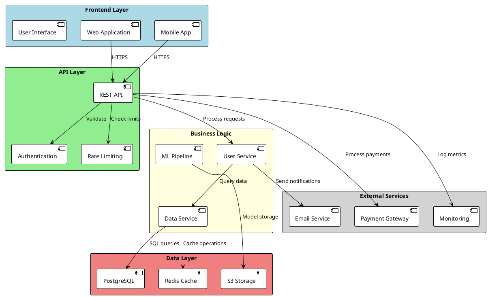
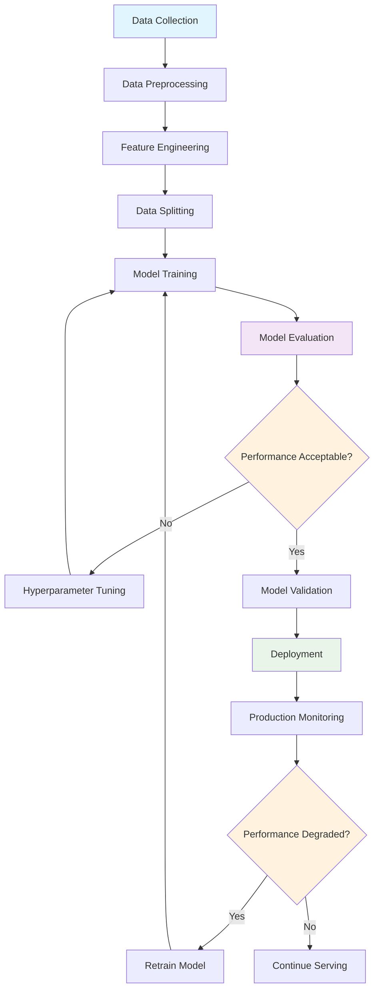
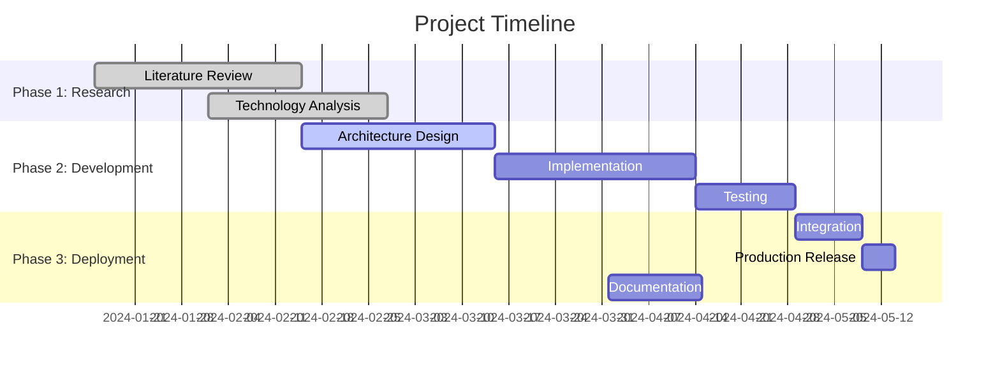

<div align="center">


<h1>📚 LaTeX Template Tutorial</h1>

**Essential Guide for Professional LaTeX Report Template**  
*From beginner to intermediate - create professional academic documents easily*

[🏁 Quick Start](#-quick-start) • [⚙️ Configuration](#️-basic-configuration) • [✍️ Writing](#️-writing-content) • [🖼️ Images](#️-working-with-images) • [📊 Tables](#-creating-tables) • [📚 Bibliography](#-managing-bibliography) • [📈 Diagrams](#-creating-diagrams) • [🔧 Troubleshooting](#-troubleshooting)

</div>

---

## 📋 Table of Contents

1. [🏁 Quick Start](#-quick-start)
2. [⚙️ Basic Configuration](#️-basic-configuration)
3. [✍️ Writing Content](#️-writing-content)
4. [🖼️ Working with Images](#️-working-with-images)
5. [📊 Creating Tables](#-creating-tables)
6. [📚 Managing Bibliography](#-managing-bibliography)
7. [📈 Creating Diagrams](#-creating-diagrams)
8. [🔄 Compilation](#-compilation)
9. [🔧 Troubleshooting](#-troubleshooting)

---

## 🏁 Quick Start

### Choose Your Method

<table>
<tr>
<th>🌟 Overleaf</th>
<th>💻 Local Installation</th>
</tr>
<tr>
<td>
<strong>✅ No installation needed</strong><br>
✅ Simple interface<br>
✅ Easy collaboration<br>
✅ Automatic compilation<br>
<br>
<a href="#option-1-overleaf-recommended">→ Overleaf Guide</a>
</td>
<td>
<strong>✅ Full control</strong><br>
✅ Automated scripts<br>
✅ VS Code editing<br>
✅ Git version control<br>
<br>
<a href="#option-2-local-installation">→ Local Installation</a>
</td>
</tr>
</table>

### Option 1: Overleaf (Recommended)

1. **Create Account**
   - Go to [Overleaf.com](https://overleaf.com)
   - Free registration

2. **Import Template**
   ```
   New Project → Upload Project → Select template ZIP file
   ```

3. **Configure Overleaf**
   - **Compiler**: pdfLaTeX
   - **Bibliography**: Biber
   - **Main document**: main.tex

4. **First Test**
   - Click "Recompile"
   - Verify PDF generation

### Option 2: Local Installation

#### Step 1: Install LaTeX

**Windows:**
```bash
# Download MiKTeX from https://miktex.org
# OR TeX Live from https://tug.org/texlive/
```

**macOS:**
```bash
# Install MacTeX with Homebrew
brew install --cask mactex
```

**Linux (Ubuntu/Debian):**
```bash
sudo apt update
sudo apt install texlive-full python3 python3-pip git biber
```

#### Step 2: Clone Template

```bash
# Clone repository
git clone https://github.com/sikatikenmogne/latex-report-template.git
cd latex-report-template

# Initialize structure
python init_project_structure.py

# Check installation
python scripts/check.py
```

#### Step 3: First Test

```bash
# Quick compilation
python scripts/compile.py --quick

# Full compilation
python scripts/compile.py

# Development mode (auto-compilation)
python scripts/watch.py
```

---

## ⚙️ Basic Configuration

### Project Structure Overview

```
latex-report-template/
├── .vscode/                    # VS Code configuration
├── assets/                     # Static assets
│   ├── fonts/                  # Custom fonts
│   ├── images/                 # Image organization
│   │   ├── architecture/       # System diagrams
│   │   ├── charts/             # Data visualizations
│   │   ├── diagrams/           # Technical diagrams
│   │   ├── figures/            # General figures
│   │   └── screenshots/        # Application screenshots
│   └── logos/                  # Company/institution logos
├── build/                      # Compilation output
├── config/                     # Template configuration
│   ├── colors.tex              # Color scheme
│   ├── commands.tex            # Custom commands
│   ├── metadata.tex            # Document metadata
│   ├── packages.tex            # LaTeX packages
│   └── style.tex               # Typography settings
├── content/                    # Document content
│   ├── backmatter/             # Bibliography, appendices
│   │   └── bibliography.bib    # Reference database
│   ├── chapters/               # Main content chapters
│   └── frontmatter/            # Title page, TOC, abstract
├── diagrams/                   # Diagram source files
│   ├── mermaid/                # Mermaid diagrams
│   ├── plantuml/               # PlantUML diagrams
│   └── tikz/                   # TikZ graphics
├── scripts/                    # Build automation
│   ├── check.py                # Environment validation
│   ├── clean.py                # Clean build files
│   ├── compile.py              # Main compilation script
│   ├── install_packages.py     # Package installer
│   ├── setup_template.py       # Project setup
│   └── watch.py                # Auto-compilation
├── templates/                  # Reusable components
│   ├── boxes.tex               # Custom environments
│   ├── figures.tex             # Figure templates
│   └── tables.tex              # Table templates
├── internshipreport.cls        # LaTeX document class
├── main.tex                    # Main document file
└── README.md                   # Documentation
```

### Step 1: Document Information

Edit `config/metadata.tex`:

```latex
% =====================================================
% DOCUMENT INFORMATION
% =====================================================

% Report details
\reporttitle{Your Report Title}
\reportsubtitle{Subtitle if needed}
\reporttype{INTERNSHIP REPORT}

% Student information
\reportauthor{Your Name}
\studentid{ST2024001}
\program{Master Computer Science}
\academicyear{2024-2025}
\internshipperiod{January - June 2025}

% Academic institution
\university{University of Technology}
\academicsupervisor{Dr. Academic Supervisor}

% Company
\company{Company Name}
\companytutor{Tutor Name}

% Defense date
\defensedate{July 15, 2025}
```

### Step 2: Customize Colors

Edit `config/colors.tex`:

```latex
% Primary colors (example: professional blue)
\definecolor{primarycolor}{RGB}{25,118,210}
\definecolor{accentcolor}{RGB}{0,82,147}
\definecolor{successcolor}{RGB}{0,130,62}

% Popular company colors:
% Google: {66,133,244}
% Microsoft: {0,120,215}
% IBM: {70,107,176}
% University: adapt to your institution
```

---

## ✍️ Writing Content

### Creating a Chapter

Create `content/chapters/introduction.tex`:

```latex
\chapter{Introduction}
\label{chap:introduction}

\section{Project Context}

This internship took place at \companyref{Company Name}, 
a leader in \technology{artificial intelligence}.

\begin{objectives}
The main objectives of this internship are:
\begin{itemize}
\item Develop a \important{machine learning} solution
\item Improve performance by \metric{30\%}
\item Deploy the system in production
\end{itemize}
\end{objectives}

\section{Report Structure}

This report is organized as follows:
\begin{itemize}
\item \textbf{Chapter 2}: State of the art and technologies
\item \textbf{Chapter 3}: Adopted methodology
\item \textbf{Chapter 4}: Implementation and results
\item \textbf{Chapter 5}: Conclusion and perspectives
\end{itemize}
```

### Adding Code Listings

```latex
\section{Implementation}

The main algorithm uses \technology{Python} with \framework{TensorFlow}:

\begin{lstlisting}[language=Python, caption=Classification Model]
import tensorflow as tf
from tensorflow.keras import layers

def create_model(input_shape, num_classes):
    """Creates the classification model"""
    model = tf.keras.Sequential([
        layers.Conv2D(32, 3, activation='relu', input_shape=input_shape),
        layers.MaxPooling2D(),
        layers.Conv2D(64, 3, activation='relu'),
        layers.MaxPooling2D(),
        layers.Flatten(),
        layers.Dense(64, activation='relu'),
        layers.Dense(num_classes, activation='softmax')
    ])
    
    model.compile(
        optimizer='adam',
        loss='categorical_crossentropy',
        metrics=['accuracy']
    )
    
    return model
\end{lstlisting}

\begin{technicalbox}
\textbf{Key technical points:}
\begin{itemize}
\item Use of convolutional layers for feature extraction
\item Pooling to reduce dimensionality
\item Dropout to prevent overfitting
\item Adam optimizer for fast convergence
\end{itemize}
\end{technicalbox}
```

---

## 🖼️ Working with Images

### Image Organization

Store your images in organized directories:

```
assets/images/
├── architecture/        # System architecture diagrams
├── charts/             # Performance charts and graphs
├── diagrams/           # Technical diagrams
├── figures/            # General figures
├── screenshots/        # Application screenshots
└── logos/              # Company and institution logos
```

### Basic Image Insertion

```latex
\section{System Architecture}

The proposed architecture is illustrated in \figref{system-architecture}.

\begin{figure}[H]
\centering
\includegraphics[width=0.8\textwidth]{assets/images/architecture/system-overview.png}
\caption{General system architecture}
\label{fig:system-architecture}
\end{figure}

The system consists of three main modules:
\begin{itemize}
\item \important{Collection Module}: Data acquisition
\item \important{Processing Module}: AI analysis
\item \important{Visualization Module}: User interface
\end{itemize}
```

### Advanced Image Layouts

#### Side-by-side Images

```latex
\begin{figure}[H]
\centering
\begin{subfigure}[b]{0.45\textwidth}
\includegraphics[width=\textwidth]{assets/images/screenshots/before-optimization.png}
\caption{Before optimization}
\label{fig:before-opt}
\end{subfigure}
\hfill
\begin{subfigure}[b]{0.45\textwidth}
\includegraphics[width=\textwidth]{assets/images/screenshots/after-optimization.png}
\caption{After optimization}
\label{fig:after-opt}
\end{subfigure}
\caption{Performance comparison: before and after optimization}
\label{fig:optimization-comparison}
\end{figure}
```

#### Wrapped Images

```latex
\begin{wrapfigure}{r}{0.4\textwidth}
\centering
\includegraphics[width=0.38\textwidth]{assets/images/screenshots/mobile-interface.png}
\caption{Mobile interface}
\label{fig:mobile-ui}
\end{wrapfigure}

This text wraps around the figure, demonstrating how to integrate images 
with flowing text content. The mobile interface shown provides an intuitive 
user experience optimized for touch interactions.

The responsive design ensures optimal display across different screen sizes 
and orientations. Key features include simplified navigation, touch-friendly 
buttons, and streamlined information hierarchy.
```

### Image Best Practices

#### Supported Formats

| Format | Use Case | Recommendation |
|--------|----------|----------------|
| **PNG** | Screenshots, diagrams | Best for images with transparency |
| **JPG** | Photos, complex images | Good compression for photos |
| **PDF** | Vector graphics | Best quality, scalable |
| **SVG** | Simple vector graphics | Convert to PDF for LaTeX |

#### Size and Quality

```latex
% Responsive sizing
\includegraphics[width=0.8\textwidth]{image.png}

% Fixed dimensions with aspect ratio preservation
\includegraphics[width=10cm, height=6cm, keepaspectratio]{image.png}

% For very large images
\begin{adjustbox}{width=\textwidth, center}
\includegraphics{large-image.png}
\end{adjustbox}

% Scale to fit page
\includegraphics[scale=0.5]{image.png}
```

---

## 📊 Creating Tables

### Basic Table Structure

```latex
\section{Performance Results}

\tabref{performance-results} presents the obtained performance metrics.

\begin{table}[H]
\centering
\caption{Performance comparison before/after optimization}
\label{tab:performance-results}
\begin{tabular}{|p{4cm}|p{3cm}|p{3cm}|p{3cm}|}
\hline
\tableheadercell{Metric} & \tableheadercell{Before} & \tableheadercell{After} & \tableheadercell{Improvement} \\
\hline
Response Time & 2.3s & 0.8s & \improvement{65\%} \\
\hline
\alternaterow
Accuracy & 87.2\% & 94.1\% & \improvement{7.9\%} \\
\hline
Memory Usage & 1.2GB & 0.9GB & \improvement{25\%} \\
\hline
\alternaterow
CPU Usage & 78\% & 45\% & \improvement{42\%} \\
\hline
\end{tabular}
\end{table}
```

### Advanced Table Layouts

#### Multi-column Headers

```latex
\begin{table}[H]
\centering
\caption{Comprehensive model performance analysis}
\label{tab:comprehensive-analysis}
\begin{tabular}{|p{2.5cm}|p{2cm}|p{2cm}|p{2cm}|p{2cm}|p{2cm}|}
\hline
\multirow{2}{*}{\tableheadercell{Model}} & \multicolumn{3}{c|}{\tableheadercell{Classification Metrics}} & \multicolumn{2}{c|}{\tableheadercell{Performance}} \\
\cline{2-6}
& \tableheadercell{Accuracy} & \tableheadercell{Precision} & \tableheadercell{Recall} & \tableheadercell{Training Time} & \tableheadercell{Inference} \\
\hline
ResNet-50 & 92.3\% & 91.8\% & 92.1\% & 45 min & 32 ms \\
\hline
\alternaterow
DenseNet-121 & 94.1\% & 93.5\% & 94.2\% & 52 min & 38 ms \\
\hline
Our Model & \textcolor{successcolor}{\textbf{96.8\%}} & \textcolor{successcolor}{\textbf{96.3\%}} & \textcolor{successcolor}{\textbf{97.1\%}} & \textcolor{successcolor}{\textbf{38 min}} & \textcolor{successcolor}{\textbf{22 ms}} \\
\hline
\end{tabular}
\end{table}
```

#### Long Tables (Multiple Pages)

```latex
\begin{longtable}{|p{3cm}|p{3cm}|p{3cm}|p{4cm}|}
\caption{Detailed experimental results} \label{tab:detailed-results} \\
\hline
\tableheadercell{Experiment} & \tableheadercell{Dataset} & \tableheadercell{Accuracy} & \tableheadercell{Notes} \\
\hline
\endfirsthead

\multicolumn{4}{c}%
{{\bfseries \tablename\ \thetable{} -- continued from previous page}} \\
\hline
\tableheadercell{Experiment} & \tableheadercell{Dataset} & \tableheadercell{Accuracy} & \tableheadercell{Notes} \\
\hline
\endhead

\hline \multicolumn{4}{|r|}{{Continued on next page}} \\ \hline
\endfoot

\hline
\endlastfoot

Exp-001 & CIFAR-10 & 92.3\% & Baseline model \\
\hline
\alternaterow
Exp-002 & CIFAR-100 & 74.1\% & More challenging dataset \\
\hline
Exp-003 & ImageNet & 85.7\% & Large-scale evaluation \\
\hline
% Add more rows as needed...
\end{longtable}
```

### Financial and Data Tables

```latex
\begin{table}[H]
\centering
\caption{Quarterly performance metrics}
\label{tab:quarterly-performance}
\begin{tabular}{|p{2.5cm}|p{2.5cm}|p{2.5cm}|p{2.5cm}|p{2.5cm}|}
\hline
\tableheadercell{Quarter} & \tableheadercell{Revenue} & \tableheadercell{Growth} & \tableheadercell{Users} & \tableheadercell{Satisfaction} \\
\hline
Q1 2024 & \$2.1M & +12.3\% & 15,000 & 87.2\% \\
\hline
\alternaterow
Q2 2024 & \$2.4M & +14.7\% & 18,500 & 89.1\% \\
\hline
Q3 2024 & \$2.8M & +16.2\% & 22,000 & 91.5\% \\
\hline
\alternaterow
Q4 2024 & \$3.2M & +18.9\% & 26,500 & 93.8\% \\
\hline
\end{tabular}
\end{table}
```

---

## 📚 Managing Bibliography

### Setting Up Bibliography

#### Step 1: Create Bibliography File

Create or edit `content/backmatter/bibliography.bib`:

```bibtex
@article{lecun2015deep,
    title={Deep learning},
    author={LeCun, Yann and Bengio, Yoshua and Hinton, Geoffrey},
    journal={Nature},
    volume={521},
    number={7553},
    pages={436--444},
    year={2015},
    publisher={Nature Publishing Group}
}

@inproceedings{he2016deep,
    title={Deep residual learning for image recognition},
    author={He, Kaiming and Zhang, Xiangyu and Ren, Shaoqing and Sun, Jian},
    booktitle={Proceedings of the IEEE conference on computer vision and pattern recognition},
    pages={770--778},
    year={2016}
}

@book{goodfellow2016deep,
    title={Deep learning},
    author={Goodfellow, Ian and Bengio, Yoshua and Courville, Aaron},
    year={2016},
    publisher={MIT press}
}

@online{tensorflow2024,
    title={TensorFlow: Large-scale machine learning on heterogeneous systems},
    author={{TensorFlow Team}},
    year={2024},
    url={https://tensorflow.org/},
    note={Accessed: 2024-08-15}
}

@mastersthesis{smith2023ml,
    title={Machine Learning Applications in Healthcare: A Comprehensive Study},
    author={Smith, John},
    year={2023},
    school={MIT},
    type={Master's thesis}
}

@techreport{johnson2024ai,
    title={AI in Industry: Current Trends and Future Prospects},
    author={Johnson, Sarah and Brown, Michael},
    institution={Tech Research Institute},
    year={2024},
    number={TR-2024-01}
}
```

#### Step 2: Citation Styles

The template supports various citation styles. Common BibTeX entry types:

| Entry Type | Use Case | Required Fields |
|------------|----------|-----------------|
| `@article` | Journal articles | title, author, journal, year |
| `@book` | Books | title, author, publisher, year |
| `@inproceedings` | Conference papers | title, author, booktitle, year |
| `@mastersthesis` | Master's thesis | title, author, school, year |
| `@phdthesis` | PhD thesis | title, author, school, year |
| `@techreport` | Technical reports | title, author, institution, year |
| `@online` | Web resources | title, author, url, year |

### Using Citations in Text

#### Basic Citations

```latex
\section{Literature Review}

Deep learning has revolutionized computer vision \cite{lecun2015deep}. 
The breakthrough came with residual networks \cite{he2016deep}, which 
solved the vanishing gradient problem.

% Multiple citations
Recent advances in neural networks \cite{lecun2015deep,he2016deep,goodfellow2016deep} 
have enabled unprecedented performance in various domains.

% Textual citations
According to \citet{lecun2015deep}, deep learning models can automatically 
discover representations from data. This approach has been extensively 
documented in the literature \citep{goodfellow2016deep}.

% Page numbers
The theoretical foundations are well established \cite[p.~15]{goodfellow2016deep}.

% Include all references (even uncited)
\nocite{*}
```

#### Citation Commands

| Command | Output | Usage |
|---------|--------|-------|
| `\cite{key}` | [1] | Basic citation |
| `\citep{key}` | (Author, 2024) | Parenthetical citation |
| `\citet{key}` | Author (2024) | Textual citation |
| `\citeauthor{key}` | Author | Author name only |
| `\citeyear{key}` | 2024 | Year only |
| `\nocite{key}` | - | Include in bibliography without citing |

### Bibliography Sections

#### Standard Bibliography

```latex
% At the end of your document
\chapter*{Bibliography}
\addcontentsline{toc}{chapter}{Bibliography}
\printbibliography[heading=none]
```

#### Categorized Bibliography

```latex
% Multiple bibliography sections
\printbibliography[type=article,title={Journal Articles}]
\printbibliography[type=book,title={Books and Monographs}]
\printbibliography[type=inproceedings,title={Conference Proceedings}]
\printbibliography[type=online,title={Online Resources}]
```

### Common Bibliography Issues

#### Problem: Bibliography Not Appearing

**Check List:**
1. Bibliography file exists: `content/backmatter/bibliography.bib`
2. File contains valid BibTeX entries
3. Citations are used in text (`\cite{}` commands)
4. Biber is installed and running

**Solution:**
```bash
# Check Biber installation
biber --version

# Force bibliography compilation
python scripts/compile.py --clean

# Add at least one citation or use:
\nocite{*}  % Include all references
```

#### Problem: Citation Showing as [?]

**Causes:**
- Missing bibliography entry
- Typo in citation key
- Need multiple compilation passes

**Solution:**
```bash
# Full compilation (4 passes)
python scripts/compile.py

# Check citation keys match bibliography entries
grep "@" content/backmatter/bibliography.bib
```

---

## 📈 Creating Diagrams

### PlantUML - UML and Architecture Diagrams

#### 1. Create Source File

Create `diagrams/plantuml/system-architecture.puml`:



#### 2. Generate Image

**Online (Easiest):**
- Copy code to [plantuml.com](http://www.plantuml.com/plantuml/)
- Download PNG image
- Save to `assets/images/diagrams/`

**Local (if Java installed):**
```bash
# Download PlantUML
wget http://sourceforge.net/projects/plantuml/files/plantuml.jar

# Generate image
java -jar plantuml.jar diagrams/plantuml/system-architecture.puml
```

#### 3. Include in LaTeX

```latex
\begin{figure}[H]
\centering
\includegraphics[width=0.9\textwidth]{assets/images/diagrams/system-architecture.png}
\caption{System Architecture - High-level Overview}
\label{fig:system-architecture}
\end{figure}

The architecture follows a layered approach with clear separation of concerns:
\begin{itemize}
\item \important{Frontend Layer}: User-facing applications
\item \important{API Layer}: Request processing and security
\item \important{Business Logic}: Core application functionality
\item \important{Data Layer}: Persistent storage and caching
\end{itemize}
```

### Mermaid - Flow Charts and Process Diagrams

#### 1. Create Flow Diagram

Create `diagrams/mermaid/ml-pipeline.mmd`:



#### 2. Gantt Chart Example

Create `diagrams/mermaid/project-timeline.mmd`:



#### 3. Generate and Include

**Online:**
- Use [Mermaid Live Editor](https://mermaid.live/)
- Export as PNG
- Save to `assets/images/diagrams/`

**In LaTeX:**
```latex
\begin{figure}[H]
\centering
\includegraphics[width=0.9\textwidth]{assets/images/diagrams/ml-pipeline.png}
\caption{Machine Learning Pipeline - Development and Deployment Process}
\label{fig:ml-pipeline}
\end{figure}

The ML pipeline follows industry best practices with continuous monitoring 
and automated retraining capabilities. Key phases include data preprocessing, 
model training, validation, and production deployment with performance monitoring.
```

### TikZ - Native LaTeX Graphics

#### Neural Network Diagram

```latex
\begin{figure}[H]
\centering
\begin{tikzpicture}[
    node distance=2.5cm,
    neuron/.style={circle, draw, minimum size=1cm, fill=blue!20},
    input/.style={circle, draw, minimum size=1cm, fill=green!20},
    output/.style={circle, draw, minimum size=1cm, fill=red!20}
]

% Input layer
\node[input] (i1) at (0,3) {$x_1$};
\node[input] (i2) at (0,2) {$x_2$};
\node[input] (i3) at (0,1) {$x_3$};
\node[input] (i4) at (0,0) {$x_4$};

% Hidden layer 1
\node[neuron] (h11) at (3,2.5) {$h_{11}$};
\node[neuron] (h12) at (3,1.5) {$h_{12}$};
\node[neuron] (h13) at (3,0.5) {$h_{13}$};

% Hidden layer 2
\node[neuron] (h21) at (6,2) {$h_{21}$};
\node[neuron] (h22) at (6,1) {$h_{22}$};

% Output layer
\node[output] (o1) at (9,1.5) {$y_1$};

% Connections input to hidden 1
\foreach \i in {1,2,3,4}
  \foreach \j in {1,2,3}
    \draw[->] (i\i) -- (h1\j);

% Connections hidden 1 to hidden 2
\foreach \i in {1,2,3}
  \foreach \j in {1,2}
    \draw[->] (h1\i) -- (h2\j);

% Connections hidden 2 to output
\foreach \i in {1,2}
    \draw[->] (h2\i) -- (o1);

% Labels
\node at (0,-0.8) {\textbf{Input Layer}};
\node at (3,-0.8) {\textbf{Hidden Layer 1}};
\node at (6,-0.8) {\textbf{Hidden Layer 2}};
\node at (9,-0.8) {\textbf{Output Layer}};

\end{tikzpicture}
\caption{Deep Neural Network Architecture (4-3-2-1)}
\label{fig:neural-network}
\end{figure}
```

#### Performance Chart

```latex
\begin{figure}[H]
\centering
\begin{tikzpicture}
\begin{axis}[
    title={Training Progress Over Epochs},
    xlabel={Epoch},
    ylabel={Accuracy (\%)},
    xmin=0, xmax=100,
    ymin=70, ymax=100,
    xtick={0,20,40,60,80,100},
    ytick={70,75,80,85,90,95,100},
    legend pos=south east,
    grid=major,
    grid style=dashed,
]

\addplot[blue, mark=circle, line width=1.5pt] coordinates {
    (0,75)(10,82)(20,87)(30,90)(40,92)(50,94)
    (60,95)(70,96)(80,97)(90,97.5)(100,98)
};

\addplot[red, mark=square, line width=1.5pt] coordinates {
    (0,73)(10,79)(20,84)(30,87)(40,89)(50,91)
    (60,92)(70,93)(80,94)(90,94.5)(100,95)
};

\legend{Training Accuracy, Validation Accuracy}
\end{axis}
\end{tikzpicture}
\caption{Model Training Progress - Accuracy Evolution}
\label{fig:training-progress}
\end{figure}
```

### Diagram Best Practices

#### Guidelines

1. **Simplicity**: Avoid information overload
2. **Consistency**: Use same colors and styles throughout
3. **Readability**: Ensure text is large enough and high contrast
4. **Purpose**: Each diagram should have a clear purpose
5. **Referencing**: Always reference diagrams in text

#### Tool Recommendations

| Tool | Best For | Learning Curve | Quality |
|------|----------|---------------|---------|
| **PlantUML** | UML, Architecture | Easy | High |
| **Mermaid** | Flowcharts, Gantt | Easy | Good |
| **TikZ** | Mathematical, Precise | Hard | Excellent |
| **Draw.io** | General purpose | Easy | Good |

---

## 🔄 Compilation

### Available Scripts

| Command | Purpose | When to Use |
|---------|---------|-------------|
| `python scripts/compile.py` | Full compilation | Final document |
| `python scripts/compile.py --quick` | Fast compilation | Draft writing |
| `python scripts/watch.py` | Auto-compilation | Active development |
| `python scripts/clean.py` | Clean build files | Troubleshooting |
| `python scripts/check.py` | Validate environment | Setup verification |

### Development Workflow

#### 1. Active Development
```bash
# Watch mode (recommended during writing)
python scripts/watch.py

# Modify your .tex files
# → Automatic compilation on save
# → PDF updated automatically
```

#### 2. Quick Check
```bash
# Fast compilation to check content
python scripts/compile.py --quick

# ✅ Faster (30-60 seconds)
# ⚠️ Citations may show "?" (normal)
```

#### 3. Final Document
```bash
# Complete compilation with bibliography
python scripts/compile.py

# Full process:
# [1/4] First compilation...
# [2/4] Processing bibliography...
# [3/4] Second compilation...
# [4/4] Final compilation...
```

### Compilation Process Explained

#### Why Multiple Passes?

LaTeX compilation requires multiple passes to resolve:

1. **Pass 1**: Process text, generate `.aux` file with labels
2. **Biber**: Process bibliography, generate `.bbl` file
3. **Pass 2**: Include bibliography, update references
4. **Pass 3**: Final pass to ensure all cross-references are correct

#### Understanding Build Output

```
build/
├── main.pdf              # Final PDF output
├── main.aux              # Auxiliary file (labels, references)
├── main.log              # Compilation log (errors, warnings)
├── main.bbl              # Bibliography file (generated by Biber)
├── main.bcf              # Biber control file
├── main.run.xml          # LaTeX run information
└── main.toc              # Table of contents
```

---

## 🔧 Troubleshooting

### Common Issues and Solutions

#### 1. Bibliography Not Appearing

**Symptoms**: Bibliography section is empty

**Diagnosis**:
```bash
python scripts/check.py --bibliography
```

**Solutions**:

<details>
<summary><strong>A. Missing Bibliography File</strong></summary>

```bash
# Check if file exists
ls content/backmatter/bibliography.bib

# If missing, create sample:
mkdir -p content/backmatter
cat > content/backmatter/bibliography.bib << 'EOF'
@article{sample2024,
    title={Sample Article},
    author={John Doe},
    journal={Sample Journal},
    year={2024}
}
EOF
```

</details>

<details>
<summary><strong>B. No Citations in Document</strong></summary>

Add citations to your text:
```latex
% Add to your chapters
This approach is supported by recent research \cite{sample2024}.

% OR include all references
\nocite{*}
```

</details>

<details>
<summary><strong>C. Biber Not Running</strong></summary>

```bash
# Check Biber installation
biber --version

# Install if missing:
# Ubuntu/Debian: sudo apt-get install biber
# macOS: brew install biber
# Windows: Install with MiKTeX/TeX Live

# Force bibliography compilation
python scripts/compile.py --clean
```

</details>

#### 2. Images Not Displaying

**Solutions**:

<details>
<summary><strong>A. Path Issues</strong></summary>

```latex
% Check file path (case-sensitive on Linux/macOS)
\includegraphics[width=0.5\textwidth]{assets/images/my-image.png}

% Verify file exists
% ls assets/images/my-image.png
```

</details>

<details>
<summary><strong>B. Format Issues</strong></summary>

```bash
# Supported formats: PNG, JPG, PDF
# Convert unsupported formats:

# TIFF to PNG
convert image.tiff image.png

# SVG to PDF
inkscape --export-type=pdf image.svg
```

</details>

<details>
<summary><strong>C. Size Issues</strong></summary>

```latex
% For large images
\begin{adjustbox}{width=\textwidth,center}
\includegraphics{large-image.png}
\end{adjustbox}

% Responsive sizing
\includegraphics[width=0.8\textwidth]{image.png}
```

</details>

#### 3. Compilation Errors

**Diagnosis**:
```bash
# Verbose compilation
python scripts/compile.py --verbose

# Check environment
python scripts/check.py
```

**Common Errors**:

| Error | Cause | Solution |
|-------|-------|----------|
| `Package not found` | Missing LaTeX package | Install with package manager |
| `File not found` | Wrong file path | Check path and filename |
| `Undefined control sequence` | Typo in command | Check command spelling |
| `Missing } inserted` | Unmatched braces | Check `{` and `}` pairs |
| `Math mode error` | Wrong math syntax | Use `$...$` or `\[...\]` |

#### 4. Cross-References Showing "??"

**Cause**: Multiple compilation passes needed

**Solution**:
```bash
# Full compilation (automatic)
python scripts/compile.py

# Manual compilation
pdflatex main.tex
biber main
pdflatex main.tex
pdflatex main.tex
```

#### 5. Performance Issues

**Solutions**:

<details>
<summary><strong>A. Use Draft Mode</strong></summary>

```latex
% Add to main.tex for faster compilation
\documentclass[draft]{internshipreport}
% Images show as boxes, much faster
```

</details>

<details>
<summary><strong>B. Optimize Images</strong></summary>

```bash
# Compress PNG files
find assets/images -name "*.png" -exec pngquant --force --ext .png {} \;

# Resize large images
find assets/images -name "*.jpg" -exec convert {} -resize 1920x1080> {} \;
```

</details>

### Final Checklist

```markdown
## Pre-Submission Checklist
- [ ] Document compiles without errors
- [ ] All figures display correctly
- [ ] Bibliography is complete and formatted
- [ ] All cross-references work
- [ ] Table of contents is accurate
- [ ] Page numbering is sequential
- [ ] PDF generated in build/main.pdf
- [ ] All images are high quality
- [ ] Tables are properly formatted
- [ ] Code listings are readable
```

---

## 🎯 Quick Reference

### Essential Commands

```latex
% Text emphasis
\important{important text}
\technology{technology name}
\companyref{company name}
\metric{performance metric}

% Environments
\begin{objectives}...\end{objectives}
\begin{results}...\end{results}
\begin{technicalbox}...\end{technicalbox}

% References
\figref{figure-label}
\tabref{table-label}
\chapref{chapter-label}
\cite{reference-key}
```

### Project Structure Focus

```
Your main work areas:
├── config/metadata.tex           # Your document information
├── content/chapters/             # Your chapters
├── content/backmatter/bibliography.bib  # Your references
├── assets/images/               # Your images and diagrams
└── Build with: python scripts/compile.py
```

### Workflow Summary

1. **Setup**: Configure `metadata.tex` with your information
2. **Write**: Create chapters in `content/chapters/`
3. **Images**: Add images to `assets/images/` and reference with `\figref{}`
4. **Tables**: Create tables with template styles
5. **Bibliography**: Add references to `bibliography.bib` and cite with `\cite{}`
6. **Diagrams**: Create in `diagrams/` folder using PlantUML/Mermaid/TikZ
7. **Compile**: Use `python scripts/compile.py` for final PDF

---

<div align="center">

**🎉 You're Ready to Create Professional Reports!**

*Start simple, add advanced features gradually*

[📖 README](README.md) • [🐛 Report Issues](https://github.com/sikatikenmogne/latex-report-template/issues) • [💬 Discussions](https://github.com/sikatikenmogne/latex-report-template/discussions)

</div>